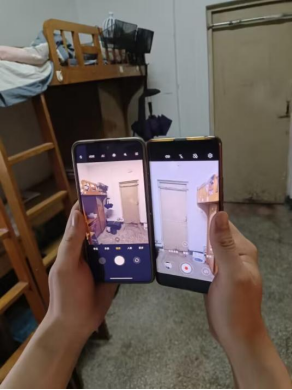
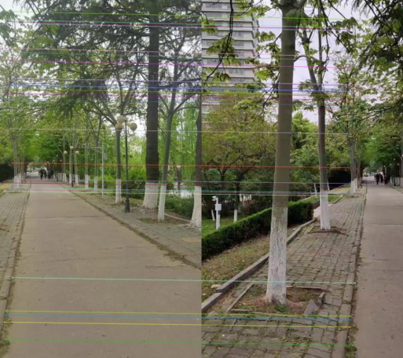
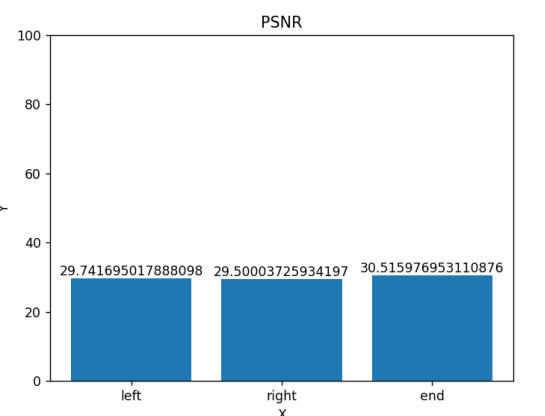
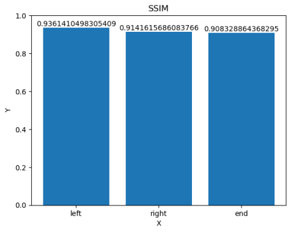

# 基于match feature的视频拼接

## 1.摘要 

​      本次大作业主要实现了视频拼接功能。视频拼接本质上是图片拼接，实现方法为利用SIFT特征匹配算法，以获取图片特征点。然后使用了KNN匹配来进行图片特征点的匹配，接着使用RANSAC算法计算视角变换矩阵，然后使用视角变换矩阵将图片进行视角变换，最后拼接两张图片。代码的创新之处在于每隔150帧计算一次视角变换矩阵，大大提高了运算效率。

## 2.数据准备

​     使用两部手机相对固定在一起并同时进行拍摄，保证曝光充分，视频稳定。两部手机相对固定在一起并同时拍是为了保证每一帧的画面可以匹配上，并且角度不宜太大，太大会导致不匹配。拍摄方案如图1所示。

​                                                           图1.拍摄方案

## 3.实现方法

1.读取视频文件并获取视频参数，包括视频的宽度、高度和帧率等，目的是为了设置输出视频的宽度和高度，帧率等等。
2.使用SIFT算法获取特征点检测，并使用KNN匹配来进行特征点匹配。
3.通过筛选出好的匹配对，使用RANSAC算法计算出视角变换矩阵M。
4.对视频1的每一帧进行视角变换，并将视频2的每一帧拼接到变换后的视频1的左侧。
并且关键的处理步骤在于使用SIFT算法进行特征点检测、使用KNN匹配来进行特征点匹配、使用RANSAC算法计算出视角变换矩阵M。SIFT算法具有较高的匹配精度和较强的鲁棒性，能够应对视频中存在的各种干扰和变形。KNN匹配更加灵活，更加准确，能够更好地应对特征点间的差异。同时，使用RANSAC算法得到的视角变换矩阵进行视角变换，能够更好地保持视频的连续性和稳定性，实现更加自然的视频拼接效果。SIFT特征匹配如图2所示。

​                                              图2.SIFT特征点匹配 

并且我觉得我们代码的创新之处在于每隔150帧计算一次视角变换矩阵，大大提高了运算效率，而不是读一帧计算一个视角变换矩阵，这样每一帧的处理时间太长。

## 4.评价指标

处理每一帧的时间约为0.0379秒

评价指标PSNR,结果如图3所示，SSIM，结果如图4所示。  

 

​                                                   图3.PSNR指标

​                                    **图4.SSIM指标**

## 5.总结与不足

在本次大作业中我们主要使用了match feature的方法来进行视频拼接。然而match feature存在局限性，总结起来以下几点：1.特征点的数量和分布不均会影响match feature的准确性；2.对光照、遮挡、噪声等变化的鲁棒性不强；3.对姿态和形变的敏感性较高。需要结合其他方法和技术来提高匹配的准确性和鲁棒性。可能需要结合其他方法和技术来提高匹配的准确性和鲁棒性。

进一步改进的措施：数据方面：提高数据的稳定性，曝光充分，相对固定。算法方面：我觉得基于深度学习的特征匹配方法更加鲁棒，对于光照变化、噪声等因素的影响较小。基于深度学习的特征匹配方法可以自动学习图像的特征表示，具有更好的泛化性能。